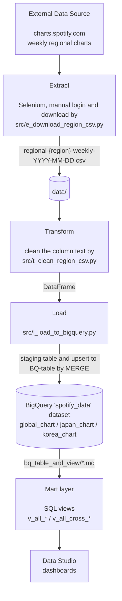

# Purpose
Scrape the weekly regional charts from Spotify Charts, load them into BigQuery (BQ), and analyze the top tracks in Japan / South Korea / Global (2026 year-to-date) with SQL views and Data Studio dashboards.

> [Live Implementation](https://datastudio.google.com/reporting/599da721-71e5-401e-ae86-92e1c715c13c)

# Background
Started as a [1-month small project for ccClub Python Fall 2025, originally written in Google Colab notebooks with Google Drive as storage. It has since been moved to GitHub and runs locally](https://github.com/Jessie-Lin-810630/Spotify_hot_chart_analysis):
- The chart ETL (extract → clean → load) was migrated from notebooks to Python scripts in `src/`, loading into BigQuery.
- Analysis moved from matplotlib / seaborn to BigQuery SQL views visualized in Data Studio.
- The original Colab notebooks (N01–N05) are kept in `src/in_colab(deprecated)/` for reference only.

# Tech. Stack
- Language: Python 3.12.8
- Extract: Selenium (Chrome, manual login)
- Transform: pandas
- Load: google-cloud-bigquery, python-dotenv
- Data warehouse: Google BigQuery (with a dataset named `spotify_data`)
- Visualization: Data Studio
- Code quality: pre-commit, ruff, nbstripout

# Architecture


# Project Structure
```
project/
├── src/
│   ├── e_download_region_csv.py   # (Extract) Open charts.spotify.com with Selenium, wait for
│   │                                manual login, then download weekly CSVs of each region
│   │                                (jp / kr / global) into data/. Existing files are skipped.
│   │
│   ├── t_clean_region_csv.py      # (Transform) Read the CSVs in data/ newer than a given date,
│   │                                derive track_id / region / date interval / ID (PK), and
│   │                                return one DataFrame matching the BigQuery schema.
│   │
│   ├── l_load_to_bigquery.py      # (Load) Entry point of T → L. Load the DataFrame into a
│   │                                temporary staging table, MERGE it into the region's table
│   │                                (upsert on ID), then drop the staging table.
│   │
│   └── in_colab(deprecated)/      # Original Colab notebooks N01–N05 (reference only).
│
├── bq_table_and_view/
│   ├── spotify_weekly_chart_schema.md   # Schema of the chart tables on BigQuery.
│   ├── analysis_sql_all.md              # Views for per-region dashboards (KPI, rank trend,
│   │                                      artist share) across the three regions.
│   └── analysis_sql_cross_region.md     # Views for cross-region analysis (track overlap,
│                                          overlapping tracks, rank heatmap).
│
├── requirements.txt
├── .env.example                   # Template of environment variables.
└── .pre-commit-config.yaml
```

# Get Started
1. Prerequisites: Python 3.12.8, Google Chrome, and a GCP service-account key with BigQuery access.

2. Create the virtual environment and install dependencies:
    ```bash
    cd <project-root-directory>
    python3.12 -m venv .venv
    ./.venv/bin/python -m pip install -r requirements.txt
    ```
    To activate the virtual environment in your shell (e.g. to run `python` / `pre-commit` directly):
    ```bash
    source .venv/bin/activate      # macOS / Linux
    .venv\Scripts\activate         # Windows
    deactivate                     # leave the virtual environment
    ```
    > The commands below call `./.venv/bin/python` explicitly, so they work with or without activation.

3. Set environment variables: copy `.env.example` to `.env` and fill in
    - `GOOGLE_APPLICATION_CREDENTIALS`: path to the service-account JSON key (granted to `BigQuery Job User` and `BigQuery Dataset Editor` at least)

4. Set up git hooks and the notebook output filter:
    ```bash
    ./.venv/bin/python -m nbstripout --install --attributes .gitattributes
    ./.venv/bin/python -m pre_commit install
    ```

5. In BigQuery, create the dataset `spotify_data` and the tables `global_chart` / `japan_chart` / `korea_chart` manually, following `bq_table_and_view/spotify_weekly_chart_schema.md`. Also, set the partitioned field on the column `date_interval_end`.

6. Run the pipeline from the project root (parameters are set in each script's `if __name__ == "__main__":` block):
    ```bash
    ./.venv/bin/python src/e_download_region_csv.py   # log in manually in the opened Chrome window
    ./.venv/bin/python src/l_load_to_bigquery.py      # runs T → L for every region
    ```

7. Create the views in BigQuery by running the SQL in `bq_table_and_view/analysis_sql_all.md`, then `bq_table_and_view/analysis_sql_cross_region.md`, in document order.
